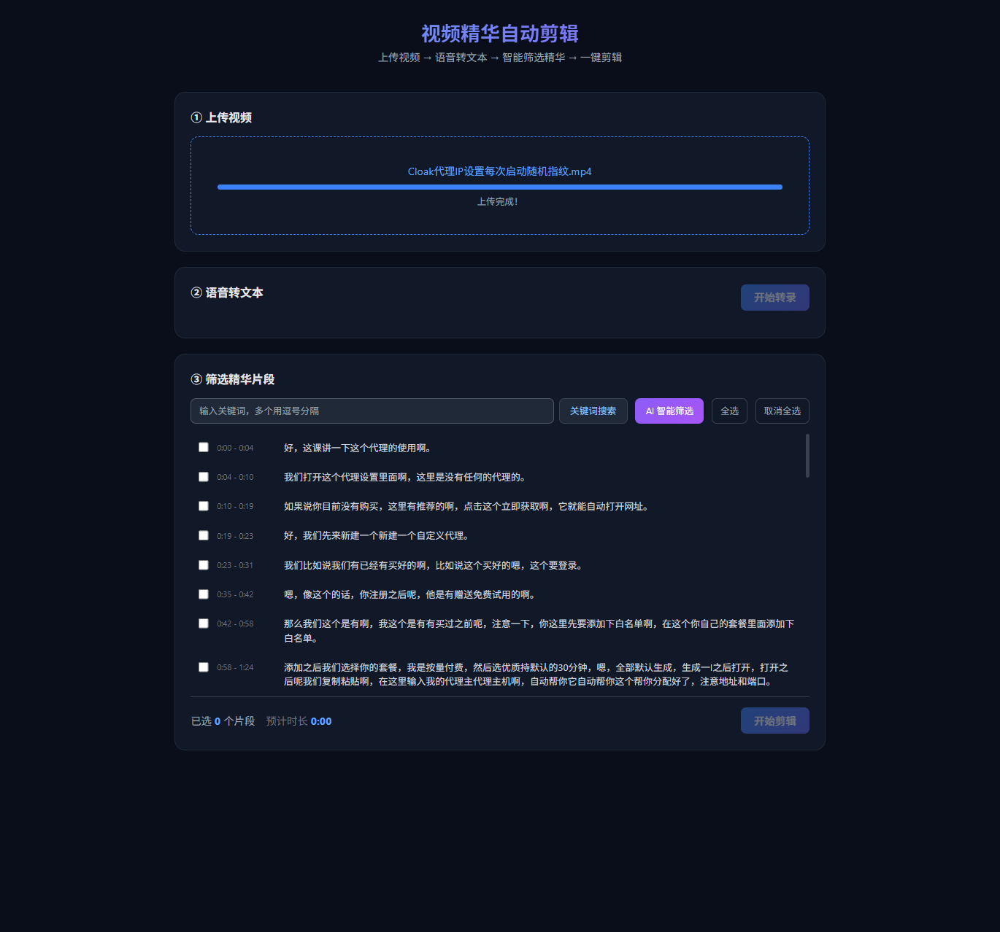
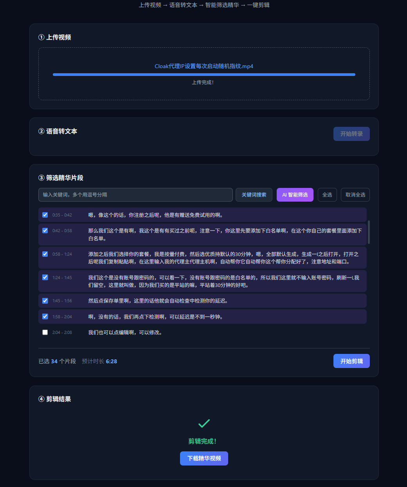

# 视频精华自动剪辑工具

上传一段带语音的视频，自动将语音转为文本，然后通过关键词搜索、AI 智能分析或手动勾选来筛选精华片段，一键剪辑输出。

## 效果截图

**语音转文本 + 片段筛选：**



**AI 智能筛选 + 剪辑完成：**



## 工作原理

```
上传视频 → FFmpeg 提取音频 → 阿里云 Paraformer 语音转文本 → 带时间戳的逐句文本
                                                                    ↓
                                              ┌─────────────────────┼─────────────────────┐
                                              ↓                     ↓                     ↓
                                         关键词搜索            AI 智能筛选           手动勾选
                                              └─────────────────────┼─────────────────────┘
                                                                    ↓
                                                  FFmpeg 按时间区间剪辑 + 合并 → 下载精华视频
```

### 核心流程

1. **音频提取**：使用 FFmpeg 从视频中提取音频（MP3 格式，体积小便于上传）
2. **语音转文本**：音频上传到阿里云临时存储，调用 DashScope Paraformer-v2 模型进行转录，返回每句话的文本和起止时间戳（毫秒级精度）
3. **精华筛选**：提供三种方式——
   - **关键词搜索**：输入关键词，自动匹配包含关键词的片段
   - **AI 智能筛选**：将全文发送给 DeepSeek LLM，由 AI 判断哪些内容最有价值
   - **手动勾选**：浏览完整时间线，自行勾选想要的片段
4. **视频剪辑**：根据选中片段的时间区间，FFmpeg 逐段切割并合并为一个完整的精华视频

### 技术栈

| 组件 | 技术 |
|------|------|
| 后端 | Python + FastAPI |
| 前端 | HTML + TailwindCSS + Vanilla JS |
| 语音转文本 | 阿里云 DashScope Paraformer-v2（支持中文/英文/方言，最大 2GB / 12 小时） |
| 智能分析 | DeepSeek API |
| 视频处理 | FFmpeg（提取音频、剪辑、合并） |

## 项目结构

```
AutoVideo/
├── .env                     # API Key 配置
├── requirements.txt         # Python 依赖
├── main.py                  # FastAPI 后端 + API 路由
├── services/
│   ├── audio_extractor.py   # FFmpeg 音频提取
│   ├── transcriber.py       # 阿里云 Paraformer 语音转文本
│   ├── highlight_finder.py  # 精华筛选（关键词 + LLM）
│   └── video_clipper.py     # FFmpeg 视频剪辑与合并
├── static/
│   ├── index.html           # 前端页面
│   ├── style.css            # 样式
│   └── app.js               # 前端交互逻辑
├── uploads/                 # 上传的视频（运行时自动创建）
└── outputs/                 # 剪辑输出（运行时自动创建）
```

## 部署步骤

### 1. 前置要求

- **Python** 3.10+
- **FFmpeg**：需安装并加入系统 PATH
  - Windows：从 https://www.gyan.dev/ffmpeg/builds/ 下载，解压后将 `bin` 目录加到环境变量
  - 验证：命令行执行 `ffmpeg -version` 能正常输出即可

### 2. 获取 API Key

需要两个 API Key：

| 服务 | 用途 | 获取地址 |
|------|------|----------|
| 阿里云百炼 DashScope | 语音转文本 | https://help.aliyun.com/zh/model-studio/get-api-key |
| DeepSeek | AI 智能筛选 | https://platform.deepseek.com/api_keys |

### 3. 安装与配置

```bash
# 克隆项目
git clone <仓库地址>
cd AutoVideo

# 安装 Python 依赖
pip install -r requirements.txt

# 配置 API Key
# 编辑 .env 文件，填入你的 Key：
#   DASHSCOPE_API_KEY=sk-xxxx
#   DEEPSEEK_API_KEY=sk-xxxx
```

### 4. 启动服务

```bash
python main.py
```

启动后访问 http://localhost:8080 即可使用。

## API 接口

| 接口 | 方法 | 说明 |
|------|------|------|
| `/api/upload` | POST | 上传视频文件，返回 task_id |
| `/api/transcribe/{task_id}` | POST | 开始语音转文本 |
| `/api/status/{task_id}` | GET | 查询任务状态和转录结果 |
| `/api/highlights/keyword` | POST | 关键词匹配筛选 |
| `/api/highlights/llm` | POST | DeepSeek AI 智能筛选 |
| `/api/clip` | POST | 执行视频剪辑 |
| `/api/download/{filename}` | GET | 下载剪辑结果 |
